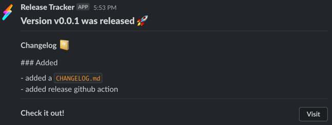
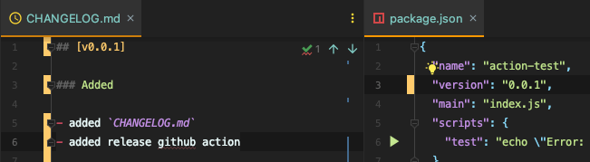

# Tag n' Slack

Creates a new Tag with a Changelog from either:

-   `CHANGELOG.md` using the `version` from `package.json`
-   commit hash and message

and notifies Slack about the release.

## Screenshot



## Usage

Here's an example on how to use the action:

`.github/workflows/release.yml`

```yaml
on:
    push:
        branches:
            - main

jobs:
    release:
        name: Release
        runs-on: ubuntu-latest
        steps:
            - name: Checkout
              uses: actions/checkout@v2
            - name: Tag n' Slack
              id: tag-n-slack
              uses: perspective-software/tag-n-slack@v1.1.5
              with:
                  github-access-token: ${{ github.token }}
                  slack-webhook-url: ${{ secrets.SLACK_WEBHOOK_RELEASE }}
                  slack-release-link: 'https://github.com/...'
                  slack-icon-emoji: ':zap:'
                  project-name: ${{ github.event.repository.name }}
                  version-increment-strategy: 'changelog-file'
                  target-commitish: 'main'
```

-   `github-access-token` (required) is automatically created during the workflow and only valid for this one workflow. Nothing to do here.
-   `slack-webhook-url` (required) is your Slack Webhook URL defined in your [Github Action's secrets](https://help.github.com/en/actions/configuring-and-managing-workflows/creating-and-storing-encrypted-secrets#creating-encrypted-secrets-for-a-repository). You can create a Slack webhook [here](https://slack.com/apps/A0F7XDUAZ-incoming-webhooks).
-   `slack-release-link` (required) is the link to your project.
-   `slack-icon-emoji` (optional, default = `:rocket:`) is the Emoji next to the Slack message. Can also be one of your workspaces custom emojis.
-   `project-name` (optional, default = `${{github.event.repository.name}}`) is the name of your project.
-   `version-increment-strategy` (optional, default = `changelog-file`, valid options = `changelog-file` or `github-releases`). `changelog-file` strategy retrieves the version from `package.json` and the release message from `CHANGELOG.md`. `github-releases` strategy retrieves the version and message from the merge commit. The version is the 7-digit hash, and the message is the commit message. It is recommended to use this strategy with "Squash and Merge" in your PRs, where the PR title and description become the commit message.

-   `target-commitish` (optional, default = `main`) is used when `version-increment-strategy` is `github-releases`, it's the project's main branch name.

## How it works

When `version-increment-strategy` is `changelog-file`, it's using [gh-release](https://github.com/ungoldman/gh-release) under the hood that parses your `package.json` and `CHANGELOG.md` for a version number. If it finds a matching version, it's extracting the latest text from the `CHANGELOG.md`, creates a new Github tag and uses the text as the body.

_If the versions don't match or a Tag with that version already exists, this action won't create a new tag and won't notify Slack._

When `version-increment-strategy` is `github-releases`, it retrieves the version and message from the merge commit. The version is the 7-digit hash, and the message is the commit message. It is recommended to use this strategy with "Squash and Merge" in your PRs, where the PR title and description become the commit message.

As an example, this action will create the Slack notification seen above:



## Development

make adjustment as required in the `src` directory and run `npm run build` to compile it to `action/index.js` (dist) before pushing.
